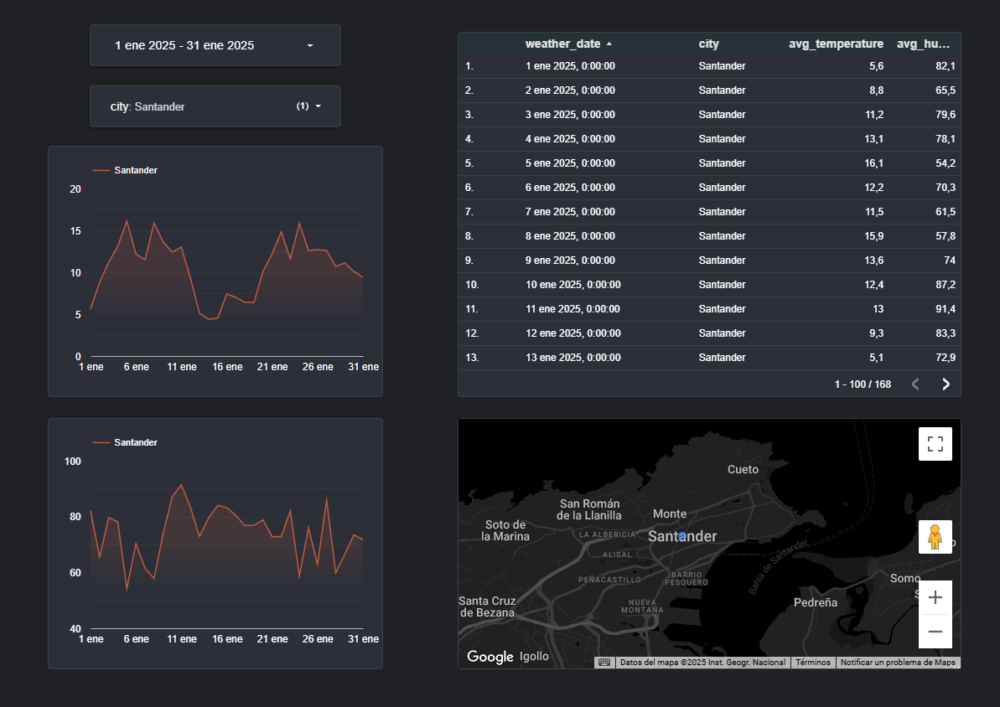

# Resumen del proyecto

Este repositorio implementa un pipeline completo de **ETL en Python** para extraer datos meteorológicos de la API de Open-Meteo y cargarlos en BigQuery usando Docker y GitHub Actions como orquestador CI/CD. Despues, utilizamos **Dataform Core** para transformar esos datos crudos en tablas “silver” dentro de BigQuery, y finalmente los exponemos en **Looker Studio** para visualización. Todo está montado con las mejores prácticas de DevOps: contenedores ligeros, manejo seguro de credenciales, retries en las peticiones HTTP y despliegue reproducible en GCP.

---

## Arquitectura general

- **Extracción**: Python + `requests.Session` con retries y timeout para recuperar datos históricos por ciudad.
- **Carga**: uso de `pandas-gbq` dentro de un contenedor Docker para insertar DataFrames en BigQuery de forma eficiente.
- **Transformación**: Dataform CLI (`@dataform/cli` v3.0.23) compila y ejecuta SQLX para agrupar valores diarios en la tabla `silver_weather`.
- **Visualización**: Looker Studio se conecta a BigQuery mediante el conector nativo para explorar y diseñar dashboards interactivos.
- **CI/CD**: GitHub Actions construye la imagen Docker, ejecuta el ETL, genera `.df-credentials.json` dinámicamente y dispara `dataform run`.

---

## Requisitos previos

- Cuenta de Google Cloud con BigQuery y permisos de `BigQuery Admin` / `Storage Object Admin`.
- Servicio de cuenta de GCP con clave JSON, almacenada como secreto en GitHub (`GCP_SERVICE_ACCOUNT_KEY_B64`).
- Node.js v18+ y NPM para instalar Dataform CLI (`npm i -g @dataform/cli`).
- Docker instalado localmente (opcional para desarrollo).

---

## 1. ETL en Python

### 1.1. `fetch_weather_data` con retries

Se emplea una sesión de `requests` con `Retry(total=5, backoff_factor=2)` y `timeout=60s` para evitar fallos intermitentes de red o lentitud de la API. Si tras 5 reintentos sigue fallando, se registra el error y se omite la ciudad sin abortar todo el pipeline.

### 1.2. `transform_weather_data`

Convierte el JSON crudo en un `pandas.DataFrame`, renombra columnas y añade la columna `city`. Estas transformaciones son puramente vectorizadas para máxima velocidad.

### 1.3. `load_to_bigquery`

Utiliza `pandas_gbq.to_gbq` con credenciales de servicio para cargar en modo `append`, detectando tipos automáticamente gracias a `autodetect=True`.

---

## 2. Contenedores y CI/CD

### 2.1. Dockerfile

Partimos de `python:3.11-slim`, instalamos dependencias de `requirements.txt` y definimos el entrypoint como `python -m scripts.main_etl`. La imagen resulta en un contenedor de \~200 MB sin cache de pip.

### 2.2. GitHub Actions (`ci.yml`)

```yaml
name: Run Daily ETL + Dataform
on:
  schedule:
    - cron: '30 5 * * *'
  workflow_dispatch:

jobs:
  pipeline:
    runs-on: ubuntu-latest
    steps:
      - uses: actions/checkout@v3
      - name: Decode GCP key
        run: echo "${{ secrets.GCP_SERVICE_ACCOUNT_KEY_B64 }}" | base64 -d > keyfile.json
      - name: Build & run ETL
        run: |
          docker build -t weather-etl .
          docker run --rm \
            -v "${{ github.workspace }}/keyfile.json:/app/keyfile.json" \
            --env GOOGLE_APPLICATION_CREDENTIALS=/app/keyfile.json \
            --env-file .env.docker \
            weather-etl
      - uses: actions/setup-node@v3
        with:
          node-version: '18'
      - name: Install Dataform CLI
        run: npm install -g @dataform/cli@3.0.23
      - name: Prepare Dataform creds
        working-directory: dataform
        run: echo "${{ secrets.GCP_SERVICE_ACCOUNT_KEY_B64 }}" | base64 -d > .df-credentials.json
      - name: Run Dataform
        working-directory: dataform
        run: dataform run
```

Este flujo asegura que tanto el ETL como las transformaciones de Dataform corran en cadena con un único secreto y sin exponer archivos sensibles.

---

## 3. Transformaciones con Dataform

### 3.1. Dataform CLI

Instalamos **Dataform CLI** (`@dataform/cli@3.0.23`) para compilar y ejecutar proyectos SQLX localmente.

### 3.2. Estructura del proyecto Dataform

```
dataform/
├─ workflow_settings.yaml
├─ definitions/
│  └─ silver_weather.sqlx
└─ includes/
```

- `workflow_settings.yaml` define `defaultProject`, `defaultDataset: silver_data` y `defaultLocation: europe-southwest1`.

### 3.3. Ejecución

Al correr `dataform run`, se genera:

```sql
CREATE OR REPLACE TABLE `procesoetl-463316.silver_data.silver_weather` AS
SELECT city, DATE(time) AS weather_date,
       ROUND(AVG(temperature_2m),1) AS avg_temperature,
       ROUND(AVG(relative_humidity_2m),1) AS avg_humidity
FROM `procesoetl-463316.raw_data_training.weather_data`
GROUP BY city, weather_date;
```

---

## 4. Integración con Looker Studio

Para visualizar tus tablas **silver**:

1. Entra en **Looker Studio** y crea un **nuevo reporte**.
2. Selecciona el **conector nativo de BigQuery**, elige tu proyecto y dataset (`silver_data`), y añade la tabla `silver_weather`.
3. Diseña gráficos de líneas y tablas para mostrar tendencias de temperatura y humedad diaria.

---

## 5. Dashboard en Looker Studio

El resultado final del pipeline puede visualizarse en este dashboard interactivo:

📊 **Vista previa:**



🔗 **[Abrir en Looker Studio](https://lookerstudio.google.com/reporting/98d79644-528c-47a7-a8ba-186cd4010f62)**

> Este dashboard muestra la evolución diaria de temperatura y humedad en múltiples ciudades españolas. Se alimenta automáticamente cada día a través del pipeline ETL y las transformaciones de Dataform.

## Estructura de carpetas

```
├── .github/ci.yml
├── Dockerfile
├── .env.docker
├── scripts/
│   ├── config.py
│   ├── etl/
│   │   ├── extract.py
│   │   ├── transform.py
│   │   └── load.py
│   └── main_etl.py
├── tests/
│   ├── test_extract.py
│   ├── test_transform.py
│   └── test_load.py
├── dataform/
│   ├── workflow_settings.yaml
│   └── definitions/
│       └── silver_weather.sqlx
├── requirements.txt
└── README.md
```
